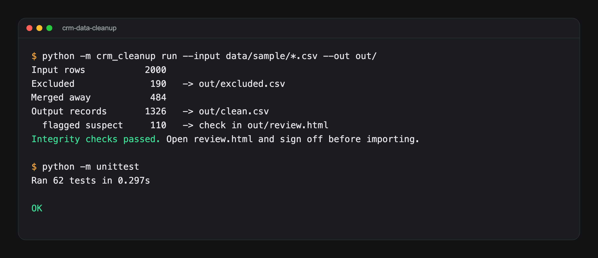
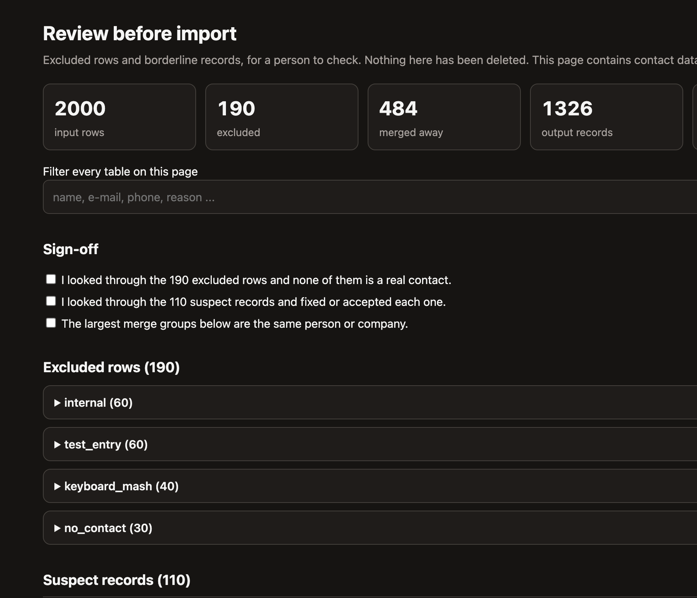

# crm-data-cleanup


CRM exports from different tools describe the same person several times, with mixed-case e-mails, phone numbers in a dozen notations, test entries, internal addresses and keyboard junk in between. Imported as they are, they fill the new CRM with duplicates and unreachable contacts; cleaned by deleting, they lose real people.

This repository shows a pipeline that cleans such exports **before** the import, never deletes a row, and gives a person a review page to sign off. Python 3.11+, standard library only.

## The four steps

1. **Load and unify.** Several CSV files with different column names are read through a small TOML mapping per source (`config.example.toml`) and turned into one common shape.
2. **Normalise.** Whitespace is collapsed. E-mails are lower-cased and validated. Phone numbers become E.164 with Germany as default country: `0151 0000 1234`, `0151/00001234`, `+49 (0)151 0000 1234` and `0049 151 0000 1234` all end up as `+4915100001234`. Numbers need 9 to 15 digits; anything that is not clearly a number is rejected, not guessed.
3. **Set aside, never delete.** Rows from internal domains, test entries, keyboard mash (a name without vowels: excluded from six letters or with a keyboard-row pattern, shorter ones such as `Plch` are only flagged) and rows without any usable contact method go to `excluded.csv` with the reason. Borderline rows stay in the output but carry `suspect = yes` and the reason.
4. **Deduplicate and merge.** Rows are grouped with union-find over the normalised e-mail **and** phone number, transitively: if A and B share an e-mail and B and C share a phone number, all three are one person. The most complete row leads; further e-mails and numbers go into `email_2` / `phone_2` (more into `more_emails` / `more_phones`), the merged rows are listed in `merged_from`. Excluded rows are set aside before matching, so a test row can never glue two real contacts together.

Then the proofs run as hard assertions, in memory and again on the files read back from disk. If one fails, the run stops with exit code 1:

- input rows = excluded + merged into another record + output records
- every input row is accounted for exactly once
- no normalised e-mail and no phone number is lost
- every e-mail, phone number and id is unique in `clean.csv`
- formats are valid (lower-case e-mail, E.164 phone, ISO date)

## Quickstart

```bash
python -m crm_cleanup run --input data/sample/*.csv --out out/
open out/review.html        # xdg-open on Linux, start on Windows
python -m unittest          # 62 tests
```



## Output

The run on the two sample files (`data/sample/`, 2,000 invented rows, seed 42):

| | Rows |
|---|---|
| Input rows | 2000 |
| excluded (`excluded.csv`) | 190 |
| merged into another record | 484 |
| **Output records (`clean.csv`)** | **1326** |

`2000 = 190 + 484 + 1326`. The excluded rows split into 60 internal, 60 test entries, 40 keyboard mash and 30 without a usable contact method. 381 output records were built from more than one row (278 pairs, 103 groups of three), and 110 records carry the `suspect` flag.

| File | Content |
|---|---|
| `out/clean.csv` | one row per person: `id, name, company, city, email, email_2, more_emails, phone, phone_2, more_phones, created, sources, merged_from, suspect, suspect_reasons, notes` |
| `out/excluded.csv` | every set-aside row with its original values and the reason |
| `out/review.html` | page for the human check: excluded rows by reason, suspect records, the largest merge groups, filter box |
| `out/report.md` | the balance above plus counts per reason, flag and group size |

One merge from the sample, three rows of two exports become one record:

```
crm_export_a  A-00172  Philipp Jung    pjung@example.com             +49 151 0000 9107    Ulm
crm_export_b  B-00904  Philipp / Jung  philipp.jung@example.com      0049 151 0000 9107   Ulm
crm_export_a  A-00016  Philipp Jung    Pjung@Example.Com             (no phone)           Ulm

-> crm_export_a:A-00172  Philipp Jung  pjung@example.com  philipp.jung@example.com  +4915100009107
   merged_from: crm_export_b:B-00904 | crm_export_a:A-00016
```

Values that cannot be normalised (an e-mail like `n/a`, a date like `31.02.2024`) are not dropped from the trail: they appear in the `notes` column.

## Why nothing is deleted

A cleanup that deletes cannot be audited. Everything the pipeline sets aside stays in `excluded.csv` with the original values and the rule that fired, and every merged row stays traceable through `merged_from`. If a rule is too strict, the row is one search away and can be put back.

## Why a person signs off before the import

The rules are heuristics. A shared mailbox such as `info@` joins people who are not the same, and a name with few vowels can be a real name. `review.html` puts the cases where this can happen in front of a person: all excluded rows, all suspect records, and the largest merge groups. The import should happen after that check, not before.



## Using your own data

Copy `config.example.toml`, list your internal domains, and map the columns of each export (`name`, or `first_name` and `last_name`; `email`, `email_2`, `phone`, `phone_2`, `company`, `city`, `created`). Put the files in `data/real/` (ignored by git) and run with `--config`:

```bash
python -m crm_cleanup run --input data/real/*.csv --out out/ --config my-config.toml
```

`out/` is ignored by git as well, because it contains contact data. When you open `clean.csv` in a spreadsheet, import it as text: spreadsheets turn `+4915100001234` into a number and drop the plus.

## Sample data

```bash
python -m crm_cleanup.generate --n 2000 --seed 42 --out data/sample/
```

The generator writes two files with different column names and only invented data: example.com / example.org addresses, made-up names, numbers in the range +49 151 0000xxxx. The same seed gives byte-identical files. It also knows the ground truth (how many rows are junk, how many people appear twice), and a test checks the pipeline against it: on the sample it finds exactly the 190 junk rows and merges exactly the 484 duplicates that were put in. That shows the mechanics work. It does not measure how well the junk rules fit your real data.

## Known limits

- **Names.** A name typed fully in capitals or fully in lower case is title-cased, so `MCDONALD` becomes `Mcdonald` and only a short list of particles (`von`, `van`, `de` ...) stays lower case. Mixed-case names are never touched.
- **Thresholds.** The suspect and exclusion thresholds (vowel share 10 % and 15 %, six letters, the keyboard-row list) are calibrated on the generated sample data. On real data, in other languages or with other naming habits, expect false alarms and misses; that is what the review page is for.
- **Matching.** Only exact e-mail and phone matches join rows. There is no fuzzy name matching, and a shared mailbox joins people who are not the same.
- **Phone numbers.** `049 151 ...` is read as country code 49 only when a separator follows, because `04921 ...` (Emden) is a national number. Digits that start with `49` and have ten or more digits are taken as international.
- **Ids.** An id or source file name that contains `|` is rejected, because `|` separates the lists in the output.

## Layout

```
crm_cleanup/   normalize.py  rules.py  dedupe.py  checks.py  pipeline.py  outputs.py  config.py  cli.py  generate.py
config.example.toml
data/sample/   two generated exports
tests/         python -m unittest
```

## License

MIT, see `LICENSE`.

## Auf Deutsch

Dieses Projekt bereinigt CRM-Kontaktexporte, bevor sie in ein neues System importiert werden. Mehrere CSV-Dateien mit unterschiedlichen Spaltennamen werden vereinheitlicht, E-Mails und Telefonnummern normalisiert und Dubletten über E-Mail und Telefon zusammengeführt, auch über mehrere Ecken. Interne Adressen, Testeinträge, Tastatur-Müll und Zeilen ohne Kontaktweg werden nie gelöscht, sondern mit Grund in `excluded.csv` abgelegt. Harte Rechenproben stellen sicher, dass keine Zeile und keine Mail oder Nummer verloren geht, sonst bricht der Lauf ab. Vor dem Import prüft ein Mensch die Sichtungsseite `review.html`, weil die Regeln Faustregeln sind und zum Beispiel ein Sammelpostfach verschiedene Personen verbinden kann.
